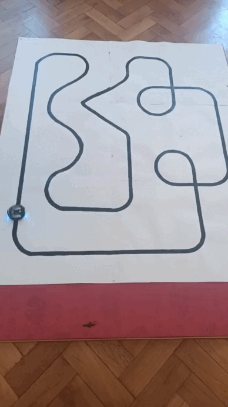
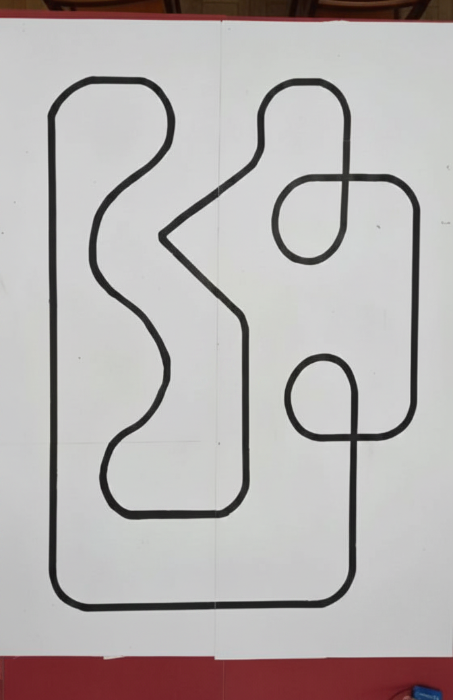

# Autonomous Line-Following Robot (Pololu 3pi / ATmega328P)

🏆 **1st Place Winner** at the **Robo Intelligence 2026** competition (2D-trace category).  
⏱️ **Official Lap Time:** **13.88 seconds**  

--

## 🏁 Track Specifications & Performance

The robot was optimized for the official competition track layout shown below:

  

The track features a mix of high-speed straight lines, where the robot actively boosted speed up to **235 PWM**, and consecutive tight S-curves, where the dynamic braking algorithm successfully maintained stability by dropping speed down to **95 PWM**.

---

## 🔴 The Hardware Challenge: Brown-out Reset (BOR)
During testing, the Pololu 3pi robot suffered from electrical instability:
* **Static Stability:** High. The robot could run at 100% motor power (255 PWM units) under linear acceleration.
* **Dynamic Stability:** Low. Rapid changes in motor direction (sudden reverse) or instant acceleration caused the battery power rail voltage to drop below **2.7V**. This voltage drop triggered a **Brown-out Reset (BOR)**, causing the ATmega328P microcontroller to reboot mid-race.

---

## 🛠️ Software-Level Solutions
To achieve maximum speed without hardware modifications, the firmware implements four software mitigation strategies:

### 1. Slew Rate Limiting (Rate of Change Filter)
Instead of applying PID output directly to the motors, the firmware implements a smoothness filter. 
* **Implementation:** The motor speed cannot increase by more than `5` units or decrease by more than `9` (or `11` during sharp turns) per loop cycle (1-2 ms).
* **Impact:** Distributes peak current draw over time, flattening the voltage drop curve and preventing BOR.

### 2. Deep Reverse Limitation
While reverse thrust helps with sharp corners, it draws twice the stall current of the motors.
* **Implementation:** Hard limit on negative motor speed set to `-40` (instead of the theoretical `-255`).
* **Impact:** Prevents extreme current spikes during rapid directional changes.

### 3. Dynamic Braking (Braking before Turning)
The robot is most vulnerable to battery rail drops during cornering.
* **Implementation:** The base speed is dynamically calculated based on the current tracking error:
  $$\text{dynamicSpeed} = \text{BASE\_SPEED} - \frac{|\text{error}|}{9}$$
* **Impact:** Automatically slows the robot down as the error increases (sharp turns), reducing centripetal force and motor strain.

### 4. "Soft" PID Tuning with Integer Math
* **Implementation:** Moderate Proportional gain (`KP_INT = 13`) paired with a high Derivative gain (`KD_INT = 1400`) to act as a damper. Calculations are optimized using bitwise shifts (`>> 8`) instead of slow floating-point math on the 8-bit AVR chip.
* **Impact:** The high $K_d$ predicts the line early and starts braking smoothly beforehand, eliminating sharp jerks and current spikes.

---

## Achievements & Official Credentials
* **1st Place Diploma:** [View Diploma](assets/diploma_robo_intel.jpg) — Official confirmation of securing the 1st place in the 2D-trace category.
* **ECTS Certificate:** [View Certificate](assets/certificate_robo_intel.jpg) — Confirms the academic workload of **0.5 ECTS credits** awarded for participation and victory.
